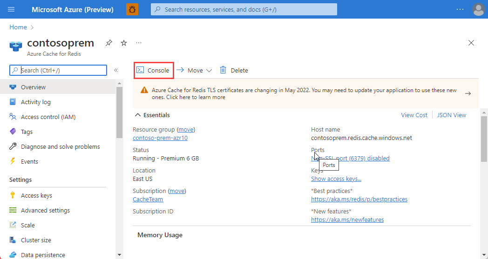
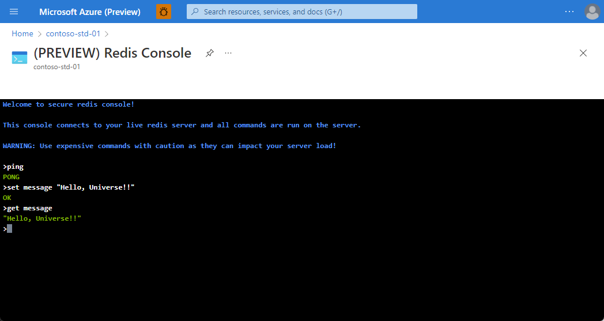

# Explore Azure Cache for Redis

## Learning Objective
Learn how to configure Azure Cache for Redis, interact with the cache, and connect an application to Azure Cache for Redis using .NET.

After completing this module, you'll be able to:

1. Explain the key scenarios Azure Cache for Redis covers and its service tiers.
1. Identify the key parameters for creating an Azure Cache for Redis instance and interact with the cache.
1. Connect an application to Azure Cache for Redis using .NET Core.

## Prerequisites

* An Azure subscription - https://azure.microsoft.com/en-gb/free/
* Visual Studio Code - https://code.visualstudio.com
* .NET 6 - https://dotnet.microsoft.com/en-us/download
* Azure CLI - https://learn.microsoft.com/en-us/cli/azure/install-azure-cli

## Create an Azure Cache for Redis using the Azure CLI
In this scenario, you learn how to create an Azure Cache for Redis. You then learn to get details of an Azure Cache for Redis instance, including provisioning status, the hostname, ports, and keys for an Azure Cache for Redis instance. Finally, you learn to delete the cache.

1. Open a shell, with Azure CLI installed. If you don't have Azure CLI installed, follow the instructions in [Install the Azure CLI](https://docs.microsoft.com/en-us/cli/azure/install-azure-cli?view=azure-cli-latest).

    > **Note**: If you are using the Azure Cloud Shell, you can skip this step.

1. Log in to your Azure account by running the following command:

    ```bash
    az login
    ```

1. Verify you're authenticated using the correct Azure subscription:

    ```bash
    az account show
    ```

    > **Note**: If you're not authenticated using the correct Azure subscription, run the following command to set the correct subscription: `az account set --subscription <subscription-id>`.

1. Create a resource group

    ```bash
    az group create --resource-group redis-cache-rg --location "UK South"
    ```

1. Create a Basic C0 (256 MB) Redis Cache

    ```bash
    az redis create --name msdocs-redis-cache --resource-group redis-cache-rg --location "UK South" --sku basic --vm-size C0
    ```

    > There are three pricing tiers available for an Azure Cache for Redis.
    >
    > 1. **Basic:** An OSS Redis cache running on a single VM. This tier has no service-level agreement (SLA) and is ideal for development/test and noncritical workloads.
    > 1. **Standard:** An OSS Redis cache running on two VMs in a replicated configuration.
    > 1. **Premium:** High-performance OSS Redis caches. This tier offers higher throughput, lower latency, better availability, and more features. Premium caches are deployed on more powerful VMs compared to the VMs for Basic or Standard caches.
    > 1. **Enterprise:** High-performance caches powered by Redis Inc.'s Redis Enterprise software. This tier supports Redis modules including RediSearch, RedisBloom, RedisJSON, and RedisTimeSeries. Also, it offers even higher availability than the Premium tier.
    > 1. **Enterprise Flash:** Cost-effective large caches powered by Redis Inc.'s Redis Enterprise software. This tier extends Redis data storage to nonvolatile memory, which is cheaper than DRAM, on a VM. It reduces the overall per-GB memory cost.
    >
    > You can control the amount of cache memory available on each tier - this is selected by choosing a cache level from C0-C6 for Basic/Standard and P0-P4 for Premium. Check the pricing page for full details.

1. Get the details of the Azure Cache for Redis instance

    ```bash
    az redis show --name msdocs-redis-cache --resource-group redis-cache-rg
    ```

1. Use the following script to retrieve the hostname, ports, and keys for an Azure Redis Cache instance:

    ```bash
    redis=($(az redis show --name msdocs-redis-cache --resource-group redis-cache-rg --query "[hostName,enableNonSslPort,port,sslPort]" --output tsv))

    keys=($(az redis list-keys --name msdocs-redis-cache --resource-group redis-cache-rg --query "[primaryKey,secondaryKey]" --output tsv))

    # Display the retrieved hostname, keys, and ports
    echo "Hostname:" ${redis[1]}
    echo "Non SSL Port:" ${redis[3]}
    echo "Non SSL Port Enabled:" ${redis[2]}
    echo "SSL Port:" ${redis[4]}
    echo "Primary Key:" ${keys[1]}
    echo "Secondary Key:" ${keys[2]}
    ```

## Accessing the Redis instance using the Redis Console
You can securely issue commands to your Azure Cache for Redis instances using the Redis Console, which is available in the Azure portal for all cache tiers.

1. Open the Redis instance in the [Azure portal](https://portal.azure.com/#view/HubsExtension/BrowseResource/resourceType/Microsoft.Cache%2FRedis).

1. To access the Redis Console, select **Console** tab in the working pane of Resource menu.

    

1. Issue the following commands against your cache instance, and review the results. To issue commands against your cache instance, type the command you want into the console:

    ```console
    > set somekey somevalue
    OK
    > get somekey
    "somevalue"
    > exists somekey
    (string) 1
    > del somekey
    (string) 1
    > exists somekey
    (string) 0
    ```

    > To issue commands against your cache instance, type the command you want into the console.
    >
    > 

1. Redis supports a set of known commands. A command is typically issued as ```COMMAND parameter1 parameter2 parameter3```. Spend some time experimenting with the commands below:
    
    - ```ping```: Ping the server. Returns "PONG".
    - ```set [key] [value]```: Sets a key/value in the cache. Returns "OK" on success.
    - ```get [key]```: Gets a value from the cache.
    - ```exists [key]```: Returns '1' if the key exists in the cache, '0' if it doesn't.
    - ```del [key]```: Deletes the value associated with the key.

## Adding an expiration time to values
Caching is important because it allows us to store commonly used values in memory. However, we also need a way to expire values when they are stale. In Redis this is done by applying a time to live (TTL) to a key.

1. Follow the steps in the script below to add a time to live to ```counter``` key:

    ```console
    > set counter 100
    OK
    > expire counter 5
    (integer) 1
    > get counter
    100
    ... wait ...
    > get counter
    (nil)
    ```

## Interact with Azure Cache for Redis by using .NET
Typically, a client application will use a client library to form requests and execute commands on a Redis cache. You can get a list of client libraries directly from the Redis clients page.

A popular high-performance Redis client for the .NET language is [StackExchange.Redis](https://github.com/StackExchange/StackExchange.Redis). The package is available through NuGet and can be added to your .NET code using the command line or IDE. Below are examples of how to use the client.

1. Create a new .NET Core console application and open the project in Visual Studio Code.

    > **Please note**: Do not run these commands in the Redis Console.

    ```bash
    dotnet new console -o redis-cache-dotnet
    cd redis-cache-dotnet
    code .
    ```

1. From the console, add the ```StackExchange.Redis``` NuGet package to the project:

    ```bash
    dotnet add package StackExchange.Redis
    ```

    > The main connection object in ```StackExchange.Redis``` is the ```StackExchange.Redis.ConnectionMultiplexer``` class. This object abstracts the process of connecting to a Redis server (or group of servers). It's optimized to manage connections efficiently and intended to be kept around while you need access to the cache.

1. Update ```Program.cs``` to create a ```ConnectionMultiplexer```:

    ```csharp
    using StackExchange.Redis;
    
    var connectionString = "[cache-name].redis.cache.windows.net:6380,password=[password-here],ssl=True,abortConnect=False";
    var redisConnection = ConnectionMultiplexer.Connect(connectionString);
    ```

    > You can obtain the ```connectionString``` from **Access keys** section of the Azure Cache for Redis instance in the Azure portal.

1. The Redis database is represented by the ```IDatabase``` type. You can retrieve one using the ```GetDatabase()``` method:

    ```csharp
    IDatabase db = redisConnection.GetDatabase();
    ```

1. Once you have a ```IDatabase``` object, you can execute methods to interact with the cache. Here is an example of storing a key/value in the cache:

    ```csharp
    bool wasSet = db.StringSet("favorite:flavor", "i-love-rocky-road");
    ```

1. We can then retrieve the value with the ```StringGet``` method:

    ```csharp
    string value = db.StringGet("favorite:flavor");
    Console.WriteLine(value); // displays: ""i-love-rocky-road""
    ```

1. The ```IDatabase``` object has an ```Execute``` and ```ExecuteAsync``` method which can be used to pass textual commands to the Redis server. For example:

    ```csharp
    var executeResult = db.Execute("ping");
    Console.WriteLine(executeResult.ToString()); // displays: "PONG"
    ```

1. Once you are done with the Redis connection, you can ```Dispose``` the ```ConnectionMultiplexer```. This will close all connections and shutdown the communication to the server.

    ```csharp
    redisConnection.Dispose();
    redisConnection = null;
    ```

## Storing more complex values
Redis is oriented around binary safe strings, but you can cache off object graphs by serializing them to a textual format - typically XML or JSON.

1. Create a new file called ```GameStat.cs``` and update accordingly:

    ```csharp
    public class GameStat
    {
        public string Id { get; set; }
        public string Sport { get; set; }
        public DateTimeOffset DatePlayed { get; set; }
        public string Game { get; set; }
        public IReadOnlyList<string> Teams { get; set; }
        public IReadOnlyList<(string team, int score)> Results { get; set; }

        public GameStat(string sport, DateTimeOffset datePlayed, string game, string[] teams, IEnumerable<(string team, int score)> results)
        {
            Id = Guid.NewGuid().ToString();
            Sport = sport;
            DatePlayed = datePlayed;
            Game = game;
            Teams = teams.ToList();
            Results = results.ToList();
        }

        public override string ToString()
        {
            return $"{Sport} {Game} played on {DatePlayed.Date.ToShortDateString()} - " +
                $"{String.Join(',', Teams)}\r\n\t" + 
                $"{String.Join('\t', Results.Select(r => $"{r.team } - {r.score}\r\n"))}";
        }
    }
    ```

1. Returning to ```Program.cs``` we can using ```System.Text.Json``` to serialize to and desialise from JSON. Update ```Program.cs``` to include the following:

    ```csharp
    using StackExchange.Redis;
    using System.Text.Json;

    var connectionString = "[cache-name].redis.cache.windows.net:6380,password=[password-here],ssl=True,abortConnect=False";
    var redisConnection = ConnectionMultiplexer.Connect(connectionString);

    IDatabase db = redisConnection.GetDatabase();
    bool wasSet = db.StringSet("favorite:flavor", "i-love-rocky-road");

    string value = db.StringGet("favorite:flavor");
    Console.WriteLine(value); // displays: ""i-love-rocky-road""

    var executeResult = db.Execute("ping");
    Console.WriteLine(executeResult.ToString()); // displays: "PONG"

    // Use the System.Text.Json to turn an instance of this object into a string:
    var stat = new GameStat
    {
        Id = Guid.NewGuid().ToString(),
        Sport = "Soccer",
        DatePlayed = new DateTime(2019, 7, 16),
        Game = "Local Game",
        Teams = new[] { "Team 1", "Team 2" },
        Results = new[] { ("Team 1", 2), ("Team 2", 1) }
    };

    string jsonString = JsonSerializer.Serialize(stat);
    bool added = db.StringSet("event:1950-world-cup", jsonString);

    // Use the System.Text.Json to turn the string back into an instance of the object:
    var result = db.StringGet("event:1950-world-cup");
    var statResult = JsonSerializer.Deserialize<GameStat>(result.ToString());
    Console.WriteLine(statResult.Sport); // displays "Soccer"

    redisConnection.Dispose();
    redisConnection = null;
    ```

## Delete the Azure Cache for Redis instance

1. Use the following script to delete the Azure Cache for Redis instance:

    ```bash
    az group delete --resource-group redis-cache-rg -y
    ```

## Additional Resources

1. [About Azure Cache for Redis](https://learn.microsoft.com/en-us/azure/azure-cache-for-redis/cache-overview)
1. [Develop for Azure Cache for Redis](https://learn.microsoft.com/en-us/training/modules/develop-for-azure-cache-for-redis/)