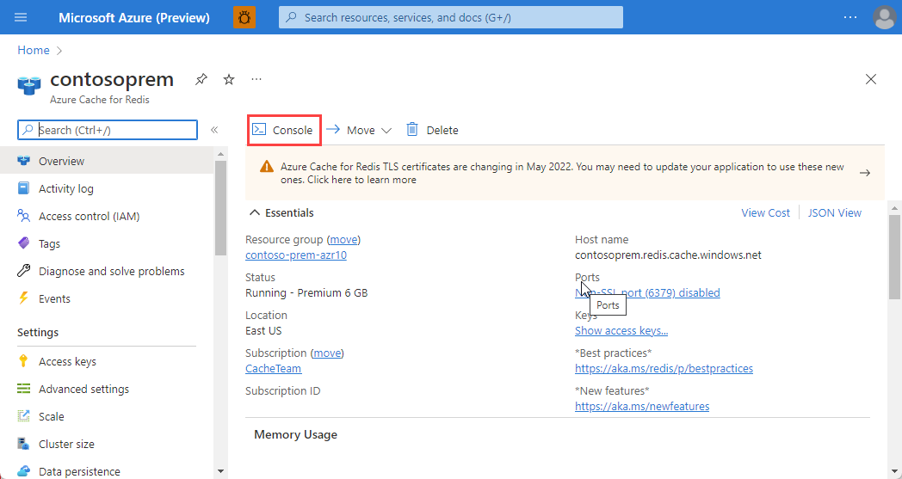

# Data in Azure Cache for Redis

## Learning Objective
Use Azure Cache for Redis to store frequently accessed data. Learn how to use ```ServiceStack.Redis``` to  create transactions and manage data expiration.

## Prerequisites

* Azure Cache for Redis instance - If you deleted your instance from the previous lab, please follow the steps [here](./labs/01-explore-azure-cache-for-redis.md#create-an-azure-cache-for-redis-using-the-azure-cli) to create a new one.

## Create a transaction in Azure Cache for Redis

1. Create a new .NET Core application, name it ```redis-data-dotnet```.

    ```bash
    dotnet new console --name redis-data-dotnet --use-program-main
    cd redis-data-dotnet
    code .
    ```

1. We need to add the ```ServiceStack.Redis``` NuGet package. This will enable us to connect to the Azure Cache for Redis, and issue commands in C#.

    ```bash
    dotnet add package ServiceStack.Redis
    ```

1. Build and run the application to make sure it all compiles. It should output "Hello World!"

    ```bash
    dotnet run
    ```

1. ```ServiceStack.Redis``` has its own connection string format: "[password]@[hostname]:[sslport]?ssl=true". Use the ```az redis list-keys``` command to retrieve the access keys and output a correctly formatted connection string.

    ```bash
    REDIS_NAME=<redis-name> name
    REDIS_KEY=$(az redis list-keys \
                --name "$REDIS_NAME" \
                --resource-group <resource-group> \
                --query primaryKey \
                --output tsv)

    echo "$REDIS_KEY"@"$REDIS_NAME".redis.cache.windows.net:6380?ssl=true
    ```

1. Open ```Program.cs``` add create the following field in the ```Program``` class and paste in your connection string as the value.

    ```csharp
    static string redisConnectionString = "<connection string>";
    ```

1. Add the following using statement to the top of the ```Program.cs``` file.

    ```csharp
    using ServiceStack.Redis;
    ```

1. In the ```Main``` method, declare a variable to store the result of the transaction.

    ```csharp
    bool transactionResult = false;
    ```

1. Using the ```redisConnectionString``` variable, create a new instance of the ```RedisClient``` class. This class will be used to interact with the Azure Cache for Redis instance.

    ```csharp
    using RedisClient redisClient = new RedisClient(redisConnectionString);
    ```

1. Create a new instance of the ```Transaction``` class. This class will be used to create, manage, and commit a transaction.

    ```csharp
    using var transaction = redisClient.CreateTransaction();
    ```

1. Add multiple operations to the transaction.

    ```csharp
    transaction.QueueCommand(c => c.Set("MyKey1", "MyValue1"));
    transaction.QueueCommand(c => c.Set("MyKey2", "MyValue2"));
    ```

1. Commit the transaction and store the result in the ```transactionResult``` variable.

    ```csharp
    transactionResult = transaction.Commit();
    ```

1. If the transaction was committed successfully, output a message to the console.

    ```csharp
    if (transactionResult)
    {
        Console.WriteLine("Transaction committed");
    }
    else
    {
        Console.WriteLine("Transaction failed to commit");
    }
    ```

1. Run the application, and verify that the console says Transaction committed.

    ```bash
    dotnet run
    ```

1. Let's verify the data we added is in our Azure Cache for Redis instance. In the [Azure portal](https://portal.azure.com/#view/HubsExtension/BrowseResource/resourceType/Microsoft.Cache%2FRedis), navigate to your Azure Cache for Redis instance.

1. In the Overview pane, select Console. This will open a Redis Console, which enables you to enter low-level Redis commands.

    

1. Run the command ```get MyKey1```. Verify that the value returned is "MyValue1".

1. Run the command ```get MyKey2```. Verify that the value returned is "MyValue2".

    

## Implement data expiration

1. In the last exercise, we left off with the following code in ```Program.cs```.

    ```csharp
    bool transactionResult = false;

    using RedisClient redisClient = new RedisClient(redisConnectionString);
    using var transaction = redisClient.CreateTransaction();
    
    transaction.QueueCommand(c => c.Set("MyKey1", "MyValue1"));
    transaction.QueueCommand(c => c.Set("MyKey2", "MyValue2"));

    transactionResult = transaction.Commit();

    if (transactionResult)
    {
        Console.WriteLine("Transaction committed");
    }
    else
    {
        Console.WriteLine("Transaction failed to commit");
    }
    ```

1. Let’s add an expiration of 15 seconds to both "MyKey1" and "MyKey2". Add the following code before you commit the transaction:

    ```csharp
    transaction.QueueCommand(c => ((RedisNativeClient)c).Expire("MyKey1", 15));
    transaction.QueueCommand(c => ((RedisNativeClient)c).Expire("MyKey2", 15));
    ```

1. Now that we added the code to expire our data, let's run the program and check that the data is removed from Azure Cache for Redis.

    ```bash
    dotnet run
    ```

1. Switch back to the Azure Cache for Redis console in the Azure portal.

1. Run the command ```get MyKey1```. Verify that the value returned is "MyValue1".

1. After 15 seconds, run the command again. You should see that the data is no longer there.

    

## Cache-aside pattern

When building an application, you want to provide a great user experience, and a part of that is quick data retrieval. Retrieving data from a database is typically a slow process, and if this data is read often, this could provide a poor user experience. The cache-aside pattern describes how you can implement a cache in conjunction with a database, to return the most commonly accessed data as quickly as possible.

> Why not have a go at implementing cache-aside? You can read more about the pattern [here](https://learn.microsoft.com/en-us/training/modules/work-with-mutable-and-partial-data-in-a-redis-cache/7-cache-aside-pattern).

## Additional Resources

1. [Work with mutable and partial data in Azure Cache for Redis](https://learn.microsoft.com/en-us/training/modules/work-with-mutable-and-partial-data-in-a-redis-cache/)