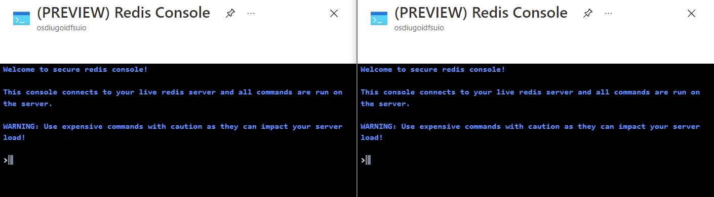
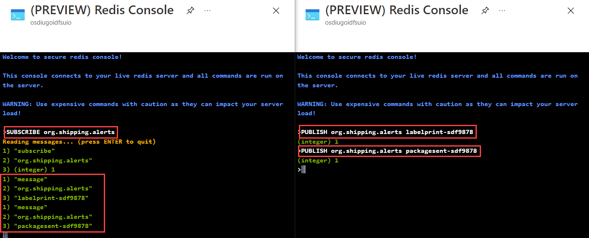

# Pub/Sub in Azure Cache for Redis

## Learning Objective
Execute Redis pub/sub commands for event-based messaging at scale in Azure Cache for Redis. Next you'll build two .NET Core applications that will publish and subscribe to messages using Azure Cache for Redis.

* Subscribe to and publish messages using Azure Cache for Redis.
* Subscribe to and publish messages using Azure Cache for Redis from a .NET Core application.

## Prerequisites

* Azure Cache for Redis instance - If you deleted your instance from the previous lab, please follow the steps [here](./labs/01-explore-azure-cache-for-redis.md#create-an-azure-cache-for-redis-using-the-azure-cli) to create a new one.

## Publish and subscribe to events from the Redis Console

> Redis' Pub/Sub exhibits *at-most-once* message delivery semantics. As the name suggests, it means that a message will be delivered once if at all. Once the message is sent by the Redis server, there's no chance of it being sent again. If the subscriber is unable to handle the message (for example, due to an error or a network disconnect) the message is forever lost.

Observe two separate clients sending and receiving messages by using two unique browser instances. Each browser instance will have the Redis console to help illustrate real-time Pub/Sub functionality.

1. Open the [Azure portal](https://portal.azure.com/#view/HubsExtension/BrowseResource/resourceType/Microsoft.Cache%2FRedis) in the first browser session. Navigate to your Azure Cache for Redis instance.

1. In the Overview pane, select Console. This will open a Redis Console, which enables you to enter low-level Redis commands.

    

1. Leave the console open to complete subsequent tasks in this exercise.

1. Open a second browser session and navigate to the [Azure portal](https://portal.azure.com/#view/HubsExtension/BrowseResource/resourceType/Microsoft.Cache%2FRedis). Navigate to your Azure Cache for Redis instance.

    > Be sure to sign in with the same account as the first browser session.

1. In the resource blade, select Console to open the Redis console. Leave the console open to complete subsequent tasks in this exercise.

1. At this point, you should have two browser instances open each with an instance of the Redis console.

    

    > If your operating system supports it, we recommend docking the browser windows side-by-side to simplify the remainder of this exercise.

1. Subscribe to channels using the ```SUBSCRIBE``` command and then publish messages using the ```PUBLISH``` command.

1. In the console of the **first** browser instance, perform the following actions:

    a. Enter the following command and use the ENTER key to begin listening for messages on the ```org.shipping.alerts``` channel.

    ```console
    SUBSCRIBE org.shipping.alerts
    ```

    b. Observe the response from the console indicating that it is now listening on the ```org.shipping.alerts``` channel.

    ```console
    Reading messages... (press ENTER to quit)
    1) "subscribe"
    2) "org.shipping.alerts"
    3) (integer) 1
    ```

    > The first element is the kind of message:
    >
    > **subscribe:** means that we successfully subscribed to the channel given as the second element in the reply. The third argument represents the number of channels we are currently subscribed to.
    >
    > **unsubscribe:** means that we successfully unsubscribed from the channel given as second element in the reply. The third argument represents the number of channels we are currently subscribed to. When the last argument is zero, we are no longer subscribed to any channel, and the client can issue any kind of Redis command as we are outside the Pub/Sub state.
    >
    > **message:** it is a message received as a result of a PUBLISH command issued by another client. The second element is the name of the originating channel, and the third argument is the actual message payload.

1. In the console of the **second** browser instance, perform the following actions:

    a. Enter the following command and use the ENTER key to send a new message with the content "labelprint-sdf9878" to the ```org.shipping.alerts``` channel.

    ```console
    PUBLISH org.shipping.alerts labelprint-sdf9878
    ```

    b. Enter the following command and use the ENTER key to send a new message with the content "labelprint-sdf9878" to the ```org.shipping.alerts``` channel.

    ```console
    PUBLISH org.shipping.alerts packagesent-sdf9878
    ```

1. Back in the console of the **first** browser instance, perform the following actions:

    a. Observe the first response from the console indicating that it has received a new message on the ```org.shipping.alerts``` channel.

    ```console
    1) "message"
    2) "org.shipping.alerts"
    3) "labelprint-sdf9878"
    ```

    b. Observe the second response from the console indicating that it has received a new message on the ```org.shipping.alerts``` channel.

    ```console
    1) "message"
    2) "org.shipping.alerts"
    3) "packagesent-sdf9878"
    ```

    

    c. Use the ENTER key to stop the console from listening to events.

    d. Enter the following command and use the ENTER key to clear the console output.

    ```console
    clear
    ```

1. Back in the console of the **second** browser instance, perform the following actions:

    a. Enter the following command and use the ENTER key to clear the console output.

    ```console
    clear
    ```

## Publish and subscribe to events from .NET Core applications

1. We'll create two .NET Core applications. The first, called ```redis-pub``` and the second called ```redis-sub```. We'll add the ```StackExchange.Redis``` NuGet package to both projects.

    ```bash
    mkdir redis-pubsub
    cd redis-pubsub

    dotnet new console --name redis-pub
    dotnet new console --name redis-sub

    cd redis-pub
    dotnet add package StackExchange.Redis

    cd ../redis-sub
    dotnet add package StackExchange.Redis

    cd ..
    code .
    ```

1. Both applications will require the same setup and boilerplate code. Update ```Program.cs``` to create a ```ConnectionMultiplexer``` in both .NET Core projects:

    ```csharp
    using StackExchange.Redis;
    
    var connectionString = "[cache-name].redis.cache.windows.net:6380,password=[password-here],ssl=True,abortConnect=False";
    var redis = ConnectionMultiplexer.Connect(connectionString);
    ```

    > You can obtain the ```connectionString``` from **Access keys** section of the Azure Cache for Redis instance in the Azure portal.

1. Let's first setup the ```dotnet-sub``` project to listen for messages on the ```org.shipping.alerts``` channel. Get an instance of ```ISubscriber``` from the ```ConnectionMultiplexer``` :

    ```csharp
    ISubscriber sub = redis.GetSubscriber();
    ```

    > The object returned from ```GetSubscriber``` is a pass-thru object that does not need to be stored. The pub/sub API has no concept of databases, but as before we can optionally provide an async-state. Note that all subscriptions are global: they are not scoped to the lifetime of the ```ISubscriber``` instance.

1. Subscribe to the ```org.shipping.alerts``` channel and handle messages using the ```OnMessage``` method:

    ```csharp
    sub.Subscribe("org.shipping.alerts").OnMessage(channelMessage => {
        Console.WriteLine((string) channelMessage.Message);
    });
    ```

1. It's also possible to use asynchronous handlers:

    ```csharp
    sub.Subscribe("org.shipping.alerts").OnMessage(async channelMessage => {
        await Task.Delay(1000);
        Console.WriteLine((string) channelMessage.Message);
    });
    ```

1. Run the ```redis-sub``` project and leave it running in the background.

    ```bash
    dotnet run --project redis-sub
    ```

    > Leave this running in the background and open a new terminal window to continue.

1. Return to the Azure Portal and open the Redis Console for the Azure Cache for Redis instance. While the subscriber is running in the background, enter the following command and use the ENTER key to publish messages on the ```org.shipping.alerts``` channel.

    ```console
    PUBLISH org.shipping.alerts packagesent-sdf9878
    ```

    > You should see the message "packagesent-sdf9878" printed twice to the console of the running ```redis-sub``` application. Once for each subscriber configured.

1. Next let's setup the ```dotnet-pub``` project to publish messages on the ```org.shipping.alerts``` channel. In the ```dotnet-pub``` get an instance of ```ISubscriber``` from the ```ConnectionMultiplexer``` :

    ```csharp
    ISubscriber sub = redis.GetSubscriber();
    ```

1. Create a ```for``` loop to publish messages on the ```org.shipping.alerts``` channel:

    ```csharp
    for (int i = 0; i < 10; i++)
    {
        sub.Publish("org.shipping.alerts", $"labelprint-sdf9878-{i}");
        Thread.Sleep(1000);
    }
    ```

1. In a new terminal running the ```dotnet-pub``` application:

    ```bash
    dotnet run --project redis-pub
    ```

    > You should see the message "labelprint-sdf9878-{i}" printed twice to the console of the running ```redis-sub``` application for each increment of ```i```.

1. Stop the ```redis-pub``` application by pressing ```CTRL+C``` in the terminal window.

1. Stop the ```redis-sub``` application by pressing ```CTRL+C``` in the terminal window.

## Additional Resources

1. [Implement Pub/Sub and Streams in Azure Cache for Redis](https://learn.microsoft.com/en-us/training/modules/azure-redis-publish-subscribe-streams/)